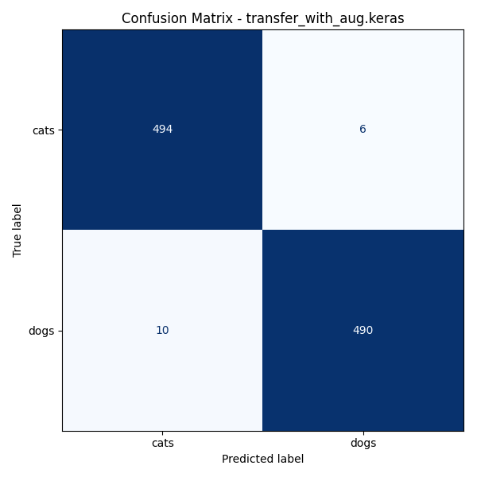
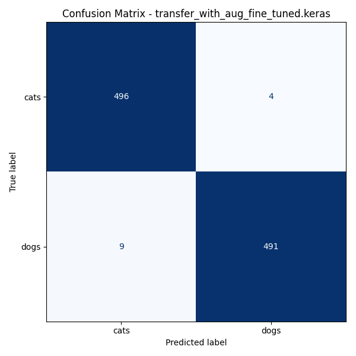

# Cat vs Dog Image Classifier (TensorFlow CNN)

Author: Wuyou Mao
This project was built as part of my personal machine learning portfolio and learning process.

This project implements an end-to-end deep learning pipeline for **cat vs dog image classification** using TensorFlow and transfer learning.

The project demonstrates a complete ML workflow including:

- Baseline CNN
- Transfer learning
- Data augmentation
- Fine-tuning
- Model evaluation
- Error analysis
- Image prediction

Final validation accuracy reaches **~98.7%** on the validation dataset.

---

# Project Structure

```
cat-dog-classifier
│
├── models
│ ├── transfer_with_aug.keras
│ └── transfer_with_aug_fine_tuned.keras
│
├── outputs
│ ├── figures
│ │ └── confusion_matrix_transfer_with_aug_fine_tuned.png
│ └── misclassified
│
├── src
│ ├── model.py
│ ├── train.py
│ ├── evaluate.py
│ └── predict.py
│
├── requirements.txt
└── README.md

```

---

# Dataset

The dataset contains labeled images of **cats and dogs**.

Structure:

```

data/
├── train/
│   ├── cats/
│   └── dogs/
│
└── validation/
    ├── cats/
    └── dogs/

```

Each class contains 1000 images.

---

# Model Pipeline

The project explores several training strategies:

### 1. Baseline CNN
A simple convolutional neural network built from scratch.

### 2. Transfer Learning
Uses a pretrained CNN backbone to extract visual features.

### 3. Data Augmentation
To improve generalization:

- Random flip
- Random rotation
- Random zoom
- Random contrast

### 4. Fine-Tuning
The last layers of the pretrained backbone are unfrozen and trained on the dataset to adapt the feature extractor.

---

# Training

Run training with:
python -m src.train

# Evaluate
Evaluate the model and generate metrics:
python -m src.evaluate

Outputs include:
    - Accuracy
    - Precision / Recall
    - Confusion matrix
    - Misclassified samples

### Confusion Matrix




### Misclassified Example


# Predict
Run prediction on a custom image:
python -m src.predict path/to/image.jpg

Example output:

Prediction: dog

Confidence: 0.97

# Error Analysis
Misclassified images are automatically exported to: outputs/misclassified/

Although the model achieves about 98% validation accuracy, analysis of the misclassified images reveals several failure modes:

1. Background dominance  
   When the animal occupies a small portion of the image and humans or other objects dominate the frame, the model may rely on contextual cues instead of the animal features.

2. Small or cat-like dog breeds  
   Some small dog breeds visually resemble cats, causing confusion in the classifier.

3. Low image quality  
   Blurry or low-resolution images reduce the effectiveness of convolutional feature extraction.

4. Unusual poses  
   Images where animals appear in uncommon orientations (e.g., rolling upside down) can challenge the learned representations.

# Tech Stack
    - Python
    - TensorFlow / Keras
    - NumPy
    - Matplotlib
    - Scikit-learn
